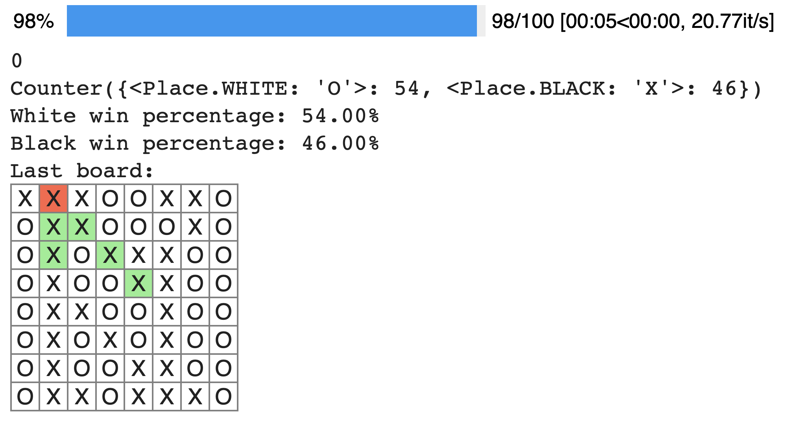

# othello
An othello simulator, in a notebook, with pretty printouts.

Open this notebook in Google Colab with this link: https://colab.research.google.com/github/mayhewsw/othello/blob/main/othello.ipynb

Some example outputs:




## Installation
If you want to run it locally, install required libraries with

```
> pip install -r requirements.txt
```